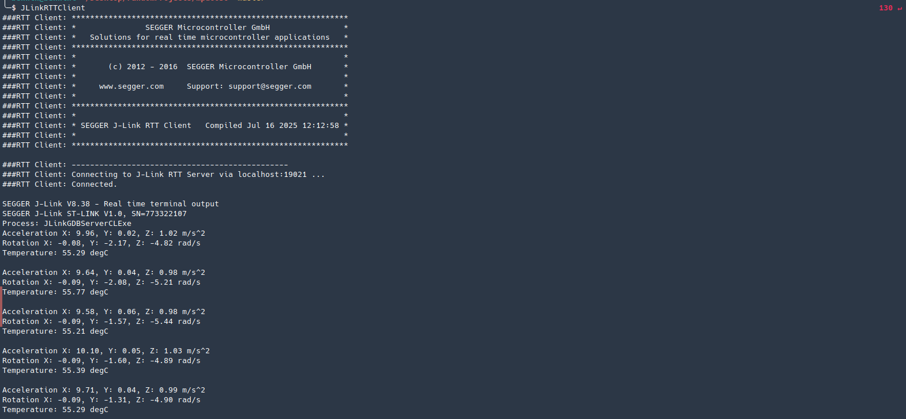
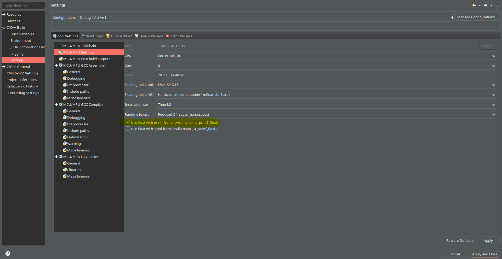

# MPU6050 STM32 Library

A lightweight C library for interfacing the MPU6050 6-axis accelerometer and gyroscope sensor with STM32 microcontrollers using HAL I2C drivers.

## API Reference

### Types
- `mpu6050_handle` — Struct holding I2C handle and device address
```
typedef struct
{
  I2C_HandleTypeDef *hi2c;
  uint8_t address;
} mpu6050_handle;
```
- `mpu6050_bandwidth_t` — Enum for filter bandwidth
```
typedef enum
{
  MPU6050_BAND_260_HZ, // Docs imply this disables the filter
  MPU6050_BAND_184_HZ, // 184 Hz
  MPU6050_BAND_94_HZ,  // 94 Hz
  MPU6050_BAND_44_HZ,  // 44 Hz
  MPU6050_BAND_21_HZ,  // 21 Hz
  MPU6050_BAND_10_HZ,  // 10 Hz
  MPU6050_BAND_5_HZ,   // 5 Hz
} mpu6050_bandwidth_t;
```
- `mpu6050_gyro_range_t` — Enum for gyro range
```
typedef enum
{
  MPU6050_RANGE_250_DEG,  // +/- 250 deg/s (default value)
  MPU6050_RANGE_500_DEG,  // +/- 500 deg/s
  MPU6050_RANGE_1000_DEG, // +/- 1000 deg/s
  MPU6050_RANGE_2000_DEG, // +/- 2000 deg/s
} mpu6050_gyro_range_t;
```
- `mpu6050_accel_range_t` — Enum for accelerometer range
```
typedef enum
{
  MPU6050_RANGE_2_G = 0b00,  // +/- 2g (default value)
  MPU6050_RANGE_4_G = 0b01,  // +/- 4g
  MPU6050_RANGE_8_G = 0b10,  // +/- 8g
  MPU6050_RANGE_16_G = 0b11, // +/- 16g
} mpu6050_accel_range_t;
```

### Functions

```c
bool mpu6050_init(const mpu6050_handle *mpuh);
bool mpu6050_reset(const mpu6050_handle *mpuh);
bool mpu6050_setSampleRateDivisor(const mpu6050_handle *mpuh, uint8_t divisor);
bool mpu6050_setFilterBandwidth(const mpu6050_handle *mpuh, mpu6050_bandwidth_t bandwidth);
bool mpu6050_setGyroRange(const mpu6050_handle *mpuh, mpu6050_gyro_range_t new_range);
bool mpu6050_setAccelerometerRange(const mpu6050_handle *mpuh, mpu6050_accel_range_t new_range);
void mpu6050_read(const mpu6050_handle *mpuh, float *temperature, float *accX, float *accY, float *accZ, float *gyroX, float *gyroY, float *gyroZ);
```

## Example Usage

```c
#include "MPU6050.h"

mpu6050_handle mpu;
mpu.hi2c = &hi2c1; // Your I2C handle
mpu.address = MPU6050_I2CADDR_DEFAULT << 1; // 8-bit address for HAL

if (mpu6050_init(&mpu)) {
    float temp, ax, ay, az, gx, gy, gz;
    mpu6050_read(&mpu, &temp, &ax, &ay, &az, &gx, &gy, &gz);
    // Use sensor data...
}
```

basic read example:

```c
#include "MPU6050.h"
#include <stdio.h>
#include <string.h>

mpu6050_handle mpuh = {
  .hi2c = &hi2c1,
  .address = MPU6050_ADDR
};

while (!mpu6050_init(&mpuh)) // Initialize the MPU
{
  HAL_Delay(10);
}

float temp, Ax, Ay, Az, Gx, Gy, Gz;
char buf[64];

for (;;)
{
  mpu6050_read(&mpuh, &temp, &Ax, &Ay, &Az, &Gx, &Gy, &Gz);

  Ax = Ax * SENSORS_GRAVITY_EARTH;
  Ax = Ay * SENSORS_GRAVITY_EARTH;
  Ax = Az * SENSORS_GRAVITY_EARTH;
  Gx = Gx * SENSORS_DPS_TO_RADS;
  Gx = Gy * SENSORS_DPS_TO_RADS;
  Gx = Gz * SENSORS_DPS_TO_RADS;

  snprintf(buf, sizeof(buf), "Acceleration X: %.2f, Y: %.2f, Z: %.2f m/s^2\n", Ax, Ay, Az);
  SEGGER_RTT_Write(0, buf, strlen(buf));

  snprintf(buf, sizeof(buf), "Rotation X: %.2f, Y: %.2f, Z: %.2f rad/s\n", Gx, Gy, Gz);
  SEGGER_RTT_Write(0, buf, strlen(buf));

  snprintf(buf, sizeof(buf), "Temperature: %.2f degC\n\n", temp);
  SEGGER_RTT_Write(0, buf, strlen(buf));

  HAL_Delay(1000);
}

```



> Problem description: The float formatting support is not enabled, check your MCU Settings from "Project Properties > C/C++ Build > Settings > Tool Settings", or add manually "-u _printf_float" in linker flags.



## License
MIT License
